# Stock Monitoring Application

### I am giving steps to deploy in local machine
resources/
# step 1: SetUp Environment *(Ignore if already done)
##    clone the repository
* git clone https://github.com/Hello-Sai/StockMonitor.git

##    Installing Modules (or) Libraries in working environment

*   `pip install -r requirements.txt`

##     Please give Database details in .env
     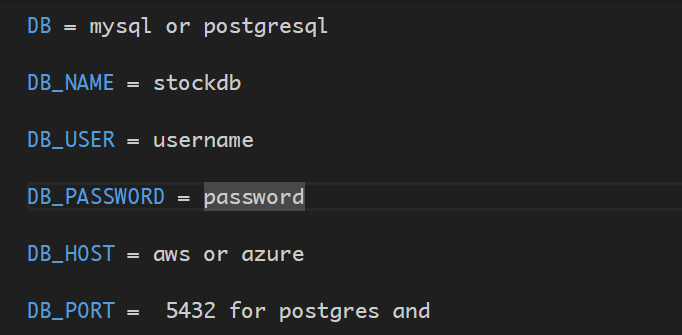

##      If you are familiar with settings.py file You can change directly here

      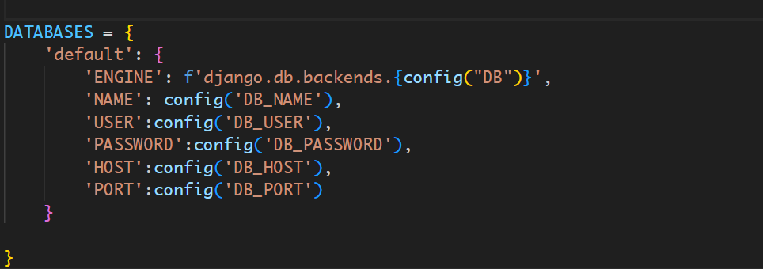

# React Project is inside the directory ui

# Please Add the node_modules through package.json. or manually in react
 To start the react application run

*    cd ui & npm start

## Home Page will be displayed and asks for login with account to see the stocks

# Register with Username and Password

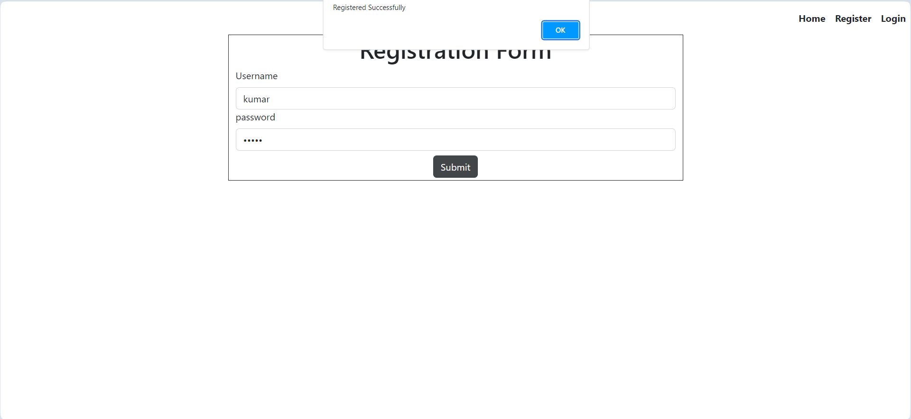

# Login with the Registered Credentials

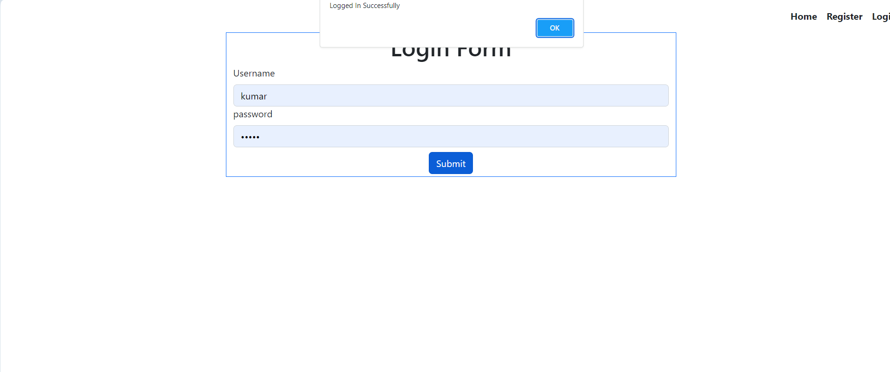

# All the Stocks can be view here

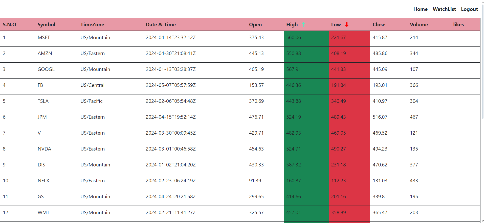

# Individual stock 
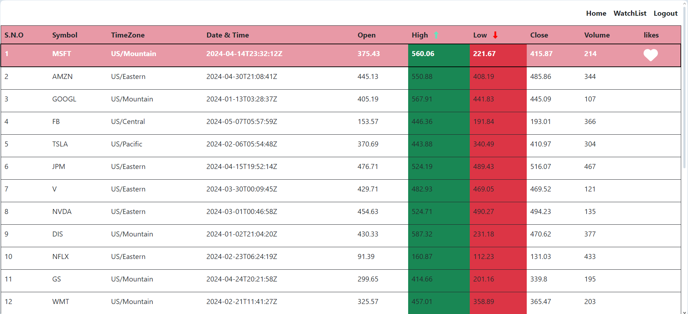

# Using like button we can add into watchlist

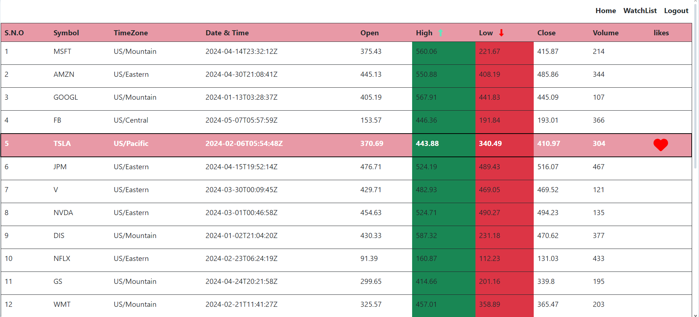

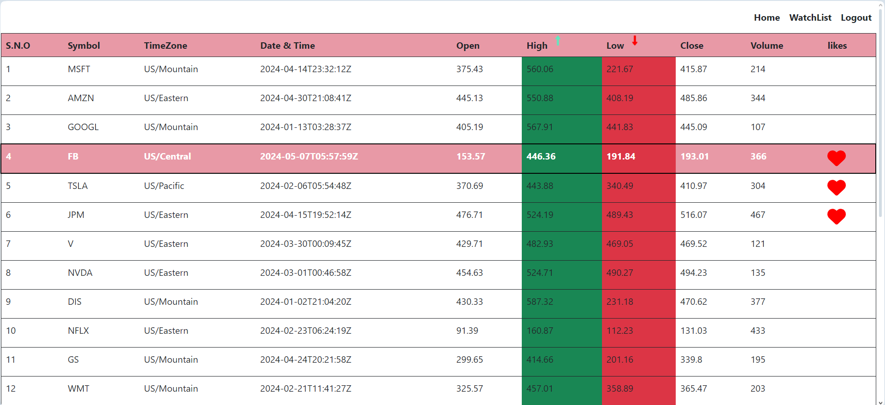

# We can view our Watch List using watchlist page

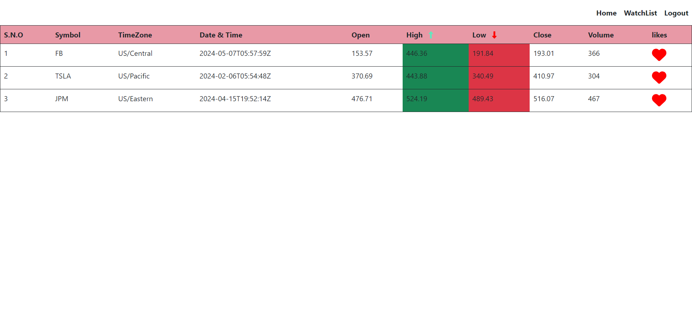

# If we can toggle the stocks based on our requirements
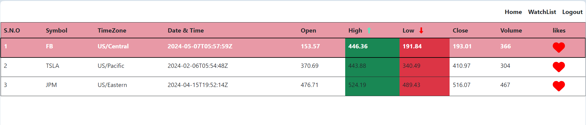

# We can see the updated watchlist

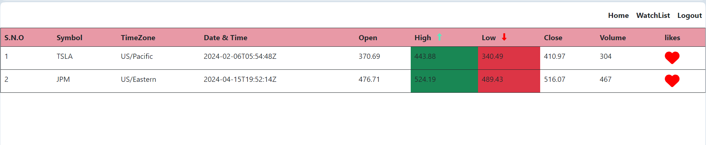

# Logout 

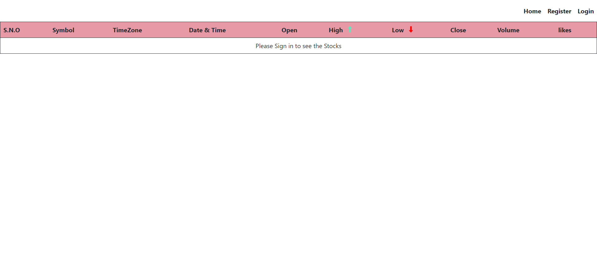

# Please **review** my project and let me know if you need any updates from my project....

